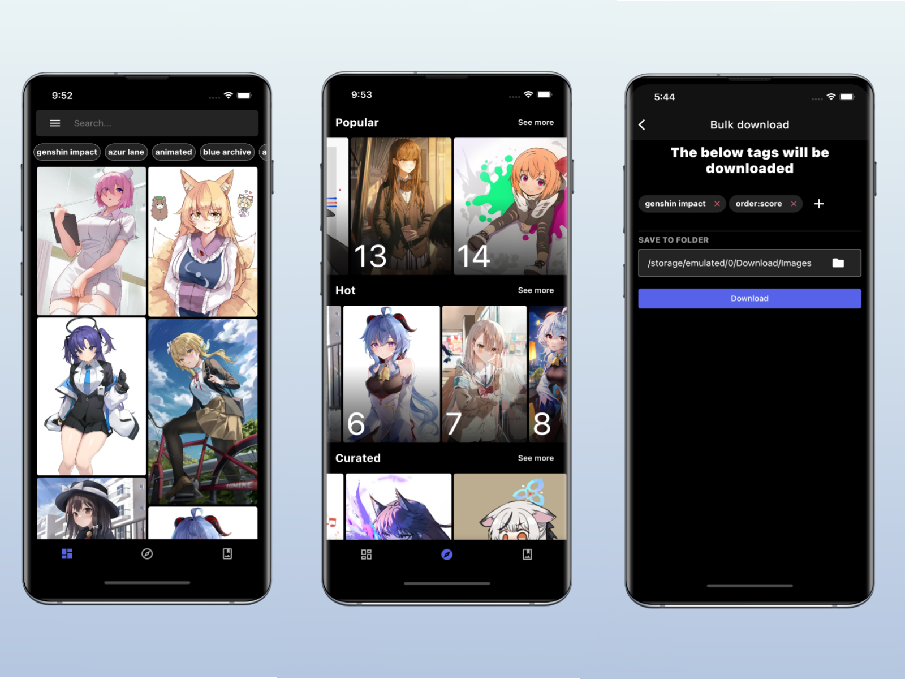
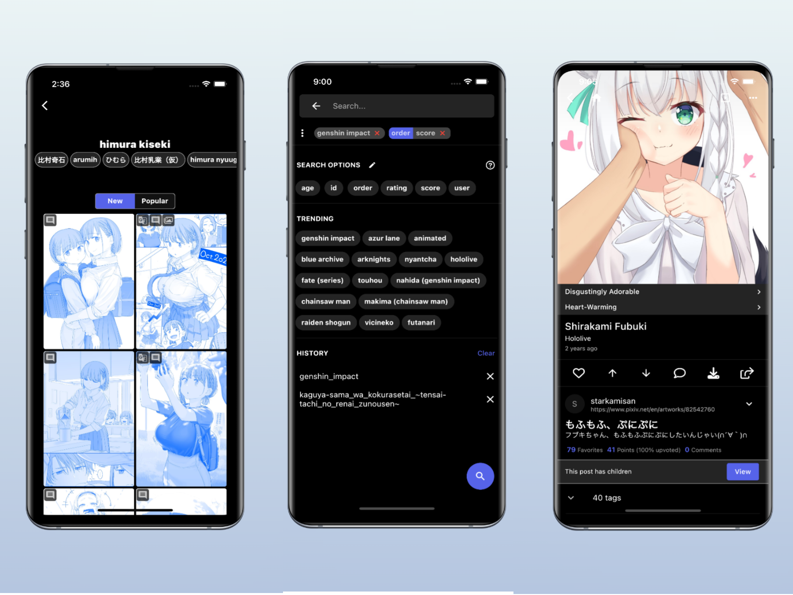

<p align="center">
 
</p>

[](https://www.gnu.org/licenses/gpl-3.0) 
[](https://discord.gg/tvyYVxjfBr) 
[](https://codecov.io/gh/khoadng/Boorusama) 


<p align="center">
  <a href="https://play.google.com/store/apps/details?id=com.degenk.boorusama">
    
  </a>
</p>

## 📚 Overview

Boorusama is an unofficial, feature-rich client for [Danbooru](https://github.com/danbooru/danbooru) and other booru based site, built with Flutter.




## 🚀 Features
Boorusama offers a wide range of functionalities including:

- Support for Danbooru-based sites, and some sites based on Gelbooru and Moebooru
- Full tag search capabilities with autocomplete and metatags highlighting
- Ability to save searches
- Options to save, import, export your favorite tags
- Quick and easy image saving
- Bulk download of multiple images
- Exploration of newest, curated, and popular posts
- Voting and commenting functionalities
- Viewing translation notes
- Image pool search, filter, and view
- Tag blacklisting
- Creation and management of multiple favorite groups based on different interests or projects.

## 📥 Installation

### Prerequisites:
- [Flutter SDK](https://docs.flutter.dev/get-started/install)
- [Git](https://git-scm.com/downloads)
- [Firebase](https://firebase.google.com/) project (Optional if you use the `boorusama-foss` branch)
- [FlutterFire](https://firebase.flutter.dev/docs/overview/) (Optional if you use the `boorusama-foss` branch)

### Steps:
1. Clone the repository:
```bash
git clone https://github.com/khoadng/Boorusama.git
cd Boorusama
```
2. Install dependencies and generate boilerplate code:
```bash
flutter pub get
flutter pub run build_runner build --delete-conflicting-outputs
```
3. Configure Firebase (Skip if you use the `boorusama-foss` branch):
```bash
dart pub global activate flutterfire_cli
flutterfire configure
```
4. Connect to an Android device/emulator and run the app:
```bash
flutter run --release
```
Or build an APK and install it manually:
```bash
flutter build apk --release
```

## 🌐 Translation
Hosted by [Weblate](https://weblate.org/en/)

<a href="https://hosted.weblate.org/engage/boorusama/">

</a>

## 📝 Feedback & Issues
Feel free to send me feedback on [Discord](https://discord.gg/tvyYVxjfBr) or [file an issue](https://github.com/khoadng/Boorusama/issues/new). Feature requests are always welcome.

## 🤝 Contributing
Pull requests are welcome. For major changes, please open an issue first to discuss what you would like to change.
